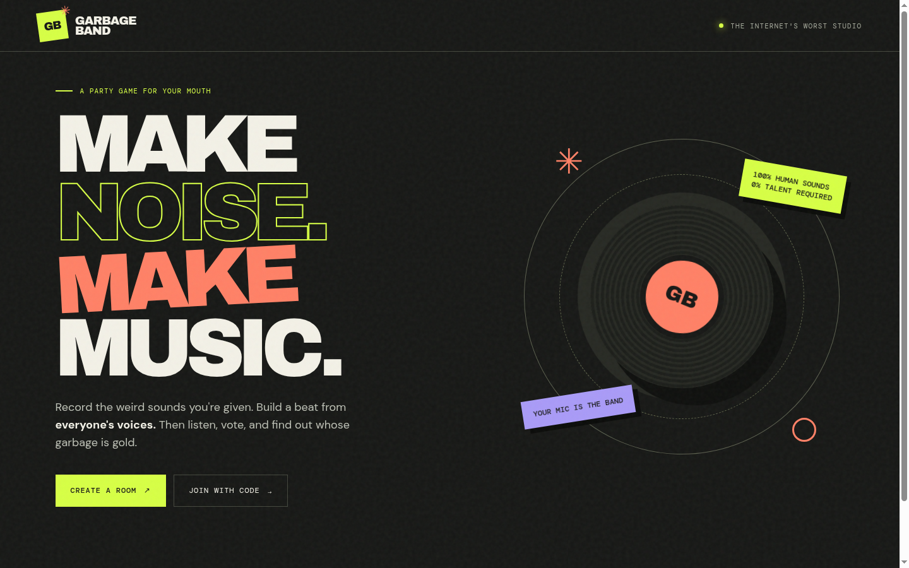

# Garbage Band

**Make noise. Make music.** Garbage Band is a multiplayer browser game where friends turn their own voice recordings into a shared sample kit, build beats, and vote for the best track.

**[Play the live game](https://garbage-band.vercel.app)** · **[Demo video](https://www.youtube.com/watch?v=5b-5CD4twRo)** . **[Building Process](https://www.youtube.com/watch?v=pDHbt9RmlVU)**



## Play a round

You need **3–8 players**, each with a browser and microphone. The host creates a room and shares its six-character code or invite link. Headphones help keep playback out of recordings.

1. **Draw a genre.** The host starts the round and everyone receives two surprise sound prompts suited to the genre.
2. **Record your sounds.** Each prompt has a playable example and a mouth cue. Make one clear sound with your voice, then preview or replace your take. The recording window closes after 30 seconds, and the browser trims lead-in air and extra attempts, balances the level, and uploads one short sample.
3. **Build a beat.** The recordings become one shared kit. Everyone makes a track using only that kit and a 16-step sequencer before the two-minute beat window closes.
4. **Listen anonymously.** Tracks play one at a time, without their makers' names. The room moves on after everyone has listened.
5. **Vote.** Pick your favorite track. You cannot vote for your own.
6. **Watch the reveal.** Third, second, and first place appear in order, each with its maker and track. The host can start another round.

To try the flow by yourself, open the live site in **three separate tabs** and join the same room with three different names. Each tab keeps its own session.

## How it works

| Part | Implementation |
| --- | --- |
| Browser app | Vanilla JavaScript and CSS; Web Audio schedules sequencer playback and synthesizes prompt examples. |
| Recording | Browser microphone capture, single-hit detection, trimming, filtering, normalization, and WAV encoding before upload. |
| Game API | Node.js functions validate room actions, assignments, tracks, and votes. |
| Shared state | Upstash Redis stores rooms with atomic updates and a 24-hour expiry after the last change. Clients poll about every two seconds. |
| Audio storage | Private Vercel Blob files are served through an authenticated game API route. A daily cron removes recordings from expired rooms. |
| Reveal | Ranking stages are calculated from a saved start timestamp, so function restarts do not reset the countdown. |

The deployed app runs on Vercel. The local server uses the same game API with in-memory stores when cloud credentials are absent.

## Run locally

Use **Node.js 22** and npm:

```bash
npm ci
npm start
```

Open **http://localhost:3000**. Run `npm test` for the automated checks. Set `PORT` to use another port.

Local rooms and recordings are stored in memory and disappear when the server restarts. Microphone access works on `localhost` or an HTTPS site; another device cannot use a plain HTTP address on your computer.

## Deploy your own Vercel instance

1. Import this repository into Vercel with the **Other** framework preset and the repository root as the root directory. `vercel.json` serves `public/` and builds `api/` as functions.
2. Create an **Upstash for Redis** resource in Vercel Marketplace and connect it to the project. The app accepts either `KV_REST_API_URL` and `KV_REST_API_TOKEN` or `UPSTASH_REDIS_REST_URL` and `UPSTASH_REDIS_REST_TOKEN`.
3. Create a **private Vercel Blob** store and connect it to the project. It supplies `BLOB_READ_WRITE_TOKEN`.
4. Add a long random `CRON_SECRET` environment variable for Production. Vercel uses it to authorize the daily `/api/cleanup` job.
5. Deploy `main`, then open the HTTPS URL and test a round in three browser tabs. Redeploy after changing integrations or environment variables.

Connect Redis and Blob to every Vercel environment you intend to use. Do not commit tokens or `.env` files. Vercel Functions have a 4.5 MB request limit, so the app sends short optimized WAV recordings and rejects a sample larger than 2.6 MB.

## Project layout

```text
public/             Browser UI, sequencer, audio processing, and prompt examples
api/                Vercel game and cleanup functions
lib/game.js         Rules, room views, voting, and reveal timing
lib/storage.js      Redis and Blob adapters, plus local memory stores
server.js           Local development server
test/               Audio, game flow, reference sound, and storage tests
```

The deployed game was checked with a complete round in three browser tabs: six recordings, three submitted tracks, anonymous listening, voting, and all three reveal positions.
